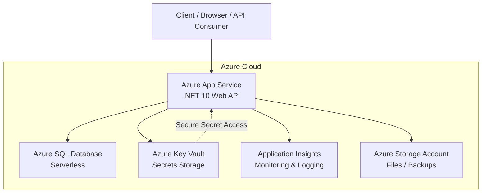

# 📘 BookCatalogApi – Azure Cloud Deployment Project

---

## 1. Overview

**BookCatalogApi** is an ASP.NET Core Web API built with **.NET 10** and **Entity Framework Core**.

The project demonstrates a complete cloud-native deployment workflow on Microsoft Azure, including:

- Azure App Service hosting
- Azure SQL Database
- Azure Key Vault integration
- Managed Identity authentication
- Application Insights monitoring
- CI/CD automation using GitHub Actions

The application was first developed and tested locally before being deployed to Azure using Infrastructure as Code (Azure CLI).

---

# 2. Architecture

The solution follows a modern cloud-native architecture.



The architecture separates concerns into compute, data, security, and observability layers.

Sensitive information is never stored directly in source code and is securely retrieved through Azure Key Vault using Managed Identity authentication.

## Core Components

- **Compute** → Azure App Service (Linux)
- **Database** → Azure SQL Database (Serverless)
- **Secrets Management** → Azure Key Vault
- **Monitoring** → Azure Application Insights
- **Automation** → GitHub Actions + Azure CLI

---

# 3. Technologies Used

| Category | Technology |
|---|---|
| Framework | ASP.NET Core Web API (.NET 10) |
| ORM | Entity Framework Core |
| Cloud Host | Azure App Service |
| Database | Azure SQL Database (Serverless) |
| Security | Azure Key Vault + Managed Identity |
| Monitoring | Azure Application Insights |
| Storage | Azure Storage Account |
| Automation | GitHub Actions + Azure CLI |

---

# 4. Local Development & Testing

Before deployment, the API was fully validated in a local development environment.

## Development Approach

- Entity Framework Core Code-First
- RESTful API architecture
- SQL Server local development database

## Implemented Endpoints

| Method | Endpoint | Description |
|---|---|---|
| GET | `/api/books` | Retrieve all books |
| POST | `/api/books` | Create a new book |
| DELETE | `/api/books/{id}` | Delete a book |

## Validation

The API was tested locally using HTTP requests and verified for:

- Correct HTTP status codes
- JSON response consistency
- Database persistence
- CRUD functionality

## Simple Demo UI

A minimal static HTML UI (`wwwroot/index.html`) is included for demonstration purposes.
It allows basic interaction with the `/api/books` endpoint in a browser and runs in the same ASP.NET Core application as the Web API.
The main focus of the project remains the API, Azure deployment, security configuration, and cloud services integration.

---

# 5. Infrastructure as Code (Azure CLI)

All Azure resources were provisioned using Azure CLI scripts to ensure repeatable and automated deployments.

## Example Provisioning Commands

```bash
# Create App Service
az webapp create --name $APP_NAME --plan $PLAN_NAME --runtime "DOTNETCORE:10.0"

# Create Serverless SQL Database
az sql db create --server $SQL_SERVER --name $DB_NAME --edition GeneralPurpose --compute-model Serverless
```

The deployment scripts automate:

- Azure App Service
- Azure SQL Database
- Firewall Rules
- Key Vault Configuration
- Managed Identity
- Application Insights
- Storage Account Creation

---

# 6. Security

## Secret Management

Sensitive values such as database connection strings are not stored directly in source code or `appsettings.json`.

Azure Key Vault is used to securely manage production secrets.

---

## Managed Identity

The Azure App Service uses a System-Assigned Managed Identity to authenticate with Azure Key Vault.

This avoids hardcoding credentials inside the application.

---

## Key Vault Access

The Web App identity was granted the following Azure RBAC role:

- `Key Vault Secrets User`

This allows the application to retrieve secrets securely at runtime.

---

## Key Vault Reference

Azure App Service configuration references secrets directly from Azure Key Vault:

```text
ConnectionStrings__DefaultConnection=@Microsoft.KeyVault(SecretUri=https://YOUR_KV.vault.azure.net/secrets/SqlConnectionString/)
```

## Network Security

Azure SQL firewall rules restrict access to:

1. Azure internal services (required for App Service)
2. Developer public IP address (required for migrations/local testing)

HTTPS-only traffic is enforced on the Web App.

---

# 7. Monitoring & Observability

Azure Application Insights provides:

- Request monitoring
- Live performance metrics
- Exception tracking
- Diagnostic logging

This was particularly useful for troubleshooting deployment and runtime issues such as HTTP 503 errors.

---

# 8. CI/CD Pipeline

Continuous Deployment is implemented using GitHub Actions.

## Workflow

Every push to the `main` branch automatically triggers:

1. Build the .NET 10 project
2. Publish deployment artifacts
3. Deploy to Azure App Service

## Deployment Security

Deployment credentials are stored securely using GitHub Secrets:

```text
AZURE_WEBAPP_PUBLISH_PROFILE
```

---

# 9. Summary

This project demonstrates modern Azure cloud deployment practices, including:

- Infrastructure as Code (IaC)
- Secure secret management
- Managed Identity authentication
- Automated CI/CD pipelines
- Centralized monitoring and logging
- Cloud-native architecture design

## Key Benefits

- Secure
- Scalable
- Automated
- Production-oriented
- Cost-efficient (Serverless SQL)

## Deployment

Detailed deployment instructions can be found in [DeploymentGuide.md](DeploymentGuide.md).